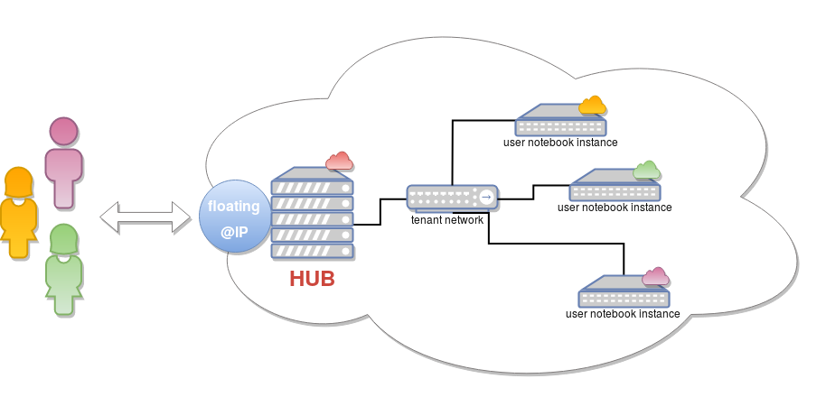

About LibCloudSpawner
=====================

LibcloudSpawner is a JupyterHub Spawner that allows JupyterHub to launch users notebooks inside a cloud instance. One instance, one user. 

LibcloudSpawner is based on Apache Libcloud which provides an abstraction API for a lot of cloud providers. By the way, LibcloudSpawner will support OpenStack, Google Cloud Engine, Amazon AWS or CloudStack...

.. note::
	For now, OpenStack is the only supported cloud provider. More cloud providers will be coming soon...

   
Internal
--------

.. image:: _static/flow-diagram.png
   :width: 600px
   :alt: Flow Diagram
   :align: center
