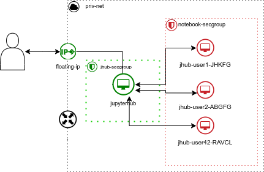

# Overview

A [Jupyterhub Spawner](https://jupyterhub.readthedocs.io/en/stable/reference/spawners.html) start each single-user notebook server. LibcloudSpawner is a spawner that operate with cloud API to manage singleuser notebook server instance life-cycle. Each Jupyterhub user will have one cloud instance for his usage.

LibcloudSpawner is based on [Apache Libcloud](https://libcloud.apache.org/) which provide an abstraction API for a lot of cloud providers. By the way, LibcloudSpawner support only OpenStack.

{ width=200px align=center}

Benefits :

* needs one small instance for JupyterHub server, all other resources are dynamic
* single-user servers have real OS, feel free to integrate them in your information system (ActiveDirectory, authentication, mountpoint...)
* simple access to VT-io or pci-passthrough devices (GPU)
* ability to host third-party services on user instance (VNC, RStudio...)
* no need for Docker or Kubernetes

Drawbacks :

* user server could be very slow to start (depending cloud provider and image size)
* no need for Docker or Kubernetes

{width=600px}